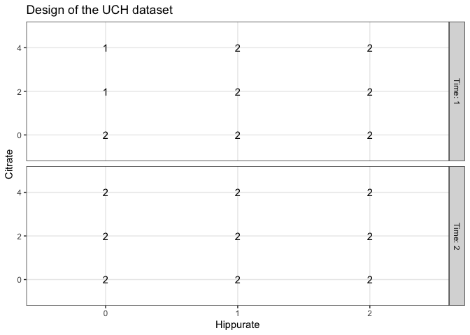
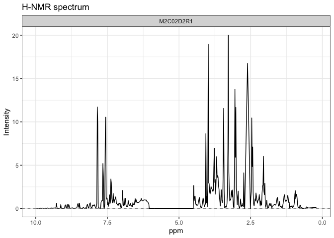
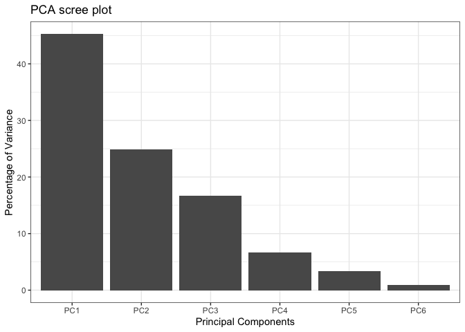
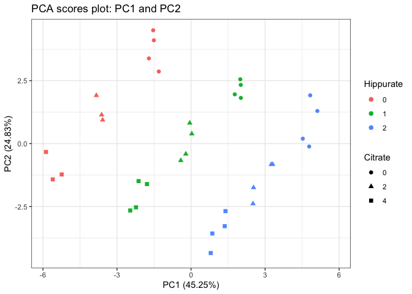
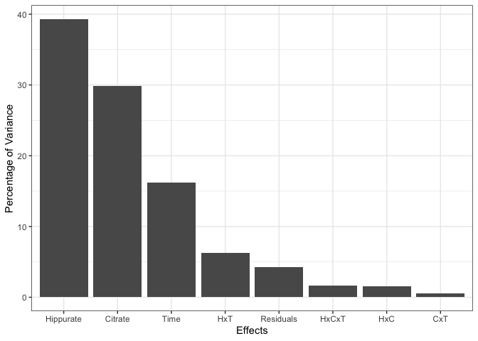
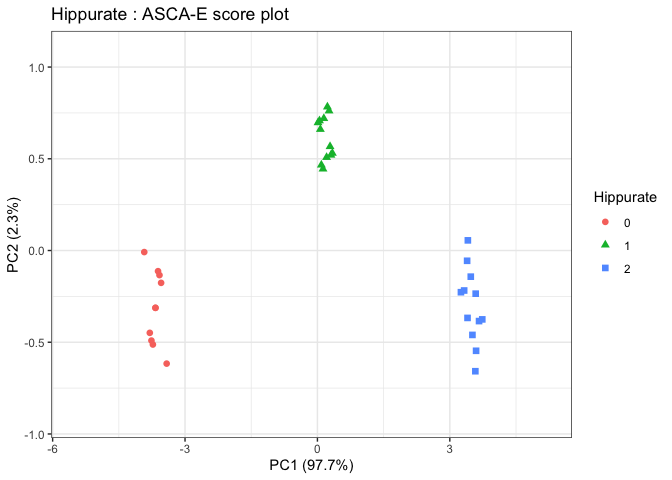
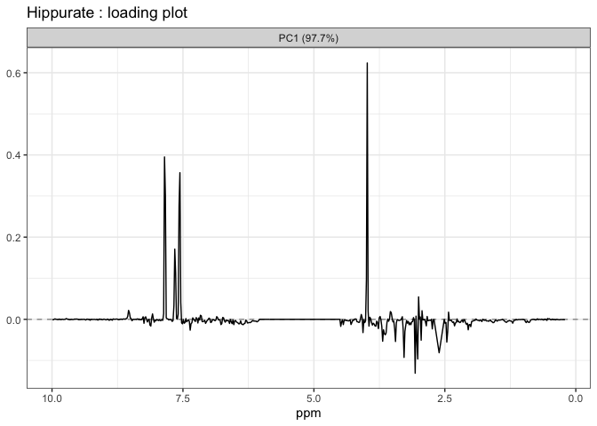

LMWiRe quickstart
================

<!-- badges: start -->

[](https://github.com/ManonMartin/LMWiRe/actions/workflows/check-standard.yaml)
<!-- badges: end -->

# Installation

``` r
remotes::install_github("ManonMartin/LMWiRe", dependencies = TRUE)
library("LMWiRe")
```

For any enquiry, you can send an email to the package authors:
<bernadette.govaerts@uclouvain.be> ; <michel.thiel@uclouvain.be> or
<manon.martin@uclouvain.be>

# Short application on the `UCH` dataset

## Data object

``` r
str(UCH)
#> List of 3
#>  $ design  :'data.frame':    34 obs. of  5 variables:
#>   ..$ Hippurate: Factor w/ 3 levels "0","1","2": 1 1 1 1 1 1 2 2 2 2 ...
#>   ..$ Citrate  : Factor w/ 3 levels "0","2","4": 1 1 2 2 3 3 1 1 2 2 ...
#>   ..$ Dilution : Factor w/ 1 level "diluted": 1 1 1 1 1 1 1 1 1 1 ...
#>   ..$ Day      : Factor w/ 2 levels "2","3": 1 1 1 1 1 1 1 1 1 1 ...
#>   ..$ Time     : Factor w/ 2 levels "1","2": 1 2 1 2 1 2 1 2 1 2 ...
#>  $ outcomes: num [1:34, 1:600] 0.0312 0.0581 0.027 0.0341 0.0406 ...
#>   ..- attr(*, "dimnames")=List of 2
#>   .. ..$   : chr [1:34] "M2C00D2R1" "M2C00D2R2" "M2C02D2R1" "M2C02D2R2" ...
#>   .. ..$ X1: chr [1:600] "9.9917004" "9.9753204" "9.9590624" "9.9427436" ...
#>  $ formula : chr "outcomes ~ Hippurate + Citrate + Time + Hippurate:Citrate + Time:Hippurate + Time:Citrate + Hippurate:Citrate:Time"
```

## Data visualisation

``` r
# design
plotDesign(design = UCH$design, x = "Hippurate", 
           y = "Citrate", rows = "Time",
           title = "Design of the UCH dataset")
```



``` r

# row 3 of outcomes
plotLine(Y = UCH$outcomes,
         title = "H-NMR spectrum",
         rows = c(3),
         xlab = "ppm",
         ylab = "Intensity")
```



## PCA

``` r
ResPCA = pcaBySvd(UCH$outcomes)
pcaScreePlot(ResPCA, nPC = 6)
```



``` r
pcaScorePlot(resPcaBySvd = ResPCA, axes = c(1,2), 
             title = "PCA scores plot: PC1 and PC2", 
             design = UCH$design,
             color = "Hippurate", shape = "Citrate",
             points_labs_rn = FALSE)
```



## Model estimation and effect matrix decomposition

``` r
# Model matrix generation
resMM = lmwModelMatrix(UCH)

# Model estimation and effect matrices decomposition
resEM = lmwEffectMatrices(resMM)
```

## Effect matrix test of significance and importance measure

``` r
# Effects importance
resEM$varPercentagesPlot
```



``` r

# Bootstrap tests
resBT = lmwBootstrapTests(resLmwEffectMatrices = resEM, nboot=100)
resBT$resultsTable
#>                       Hippurate Citrate  Time     Hippurate:Citrate
#> Bootstrap p-values    "< 0.01"  "< 0.01" "< 0.01" "0.16"           
#> % of variance (T III) "39.31"   "29.91"  "16.24"  "1.54"           
#>                       Hippurate:Time Citrate:Time Hippurate:Citrate:Time
#> Bootstrap p-values    "< 0.01"       "0.42"       "0.08"                
#> % of variance (T III) "6.23"         "0.54"       "1.68"                
#>                       Residuals
#> Bootstrap p-values    "-"      
#> % of variance (T III) "4.3"
```

## ASCA-E decomposition

``` r
# ASCA-E decomposition
resASCAE = lmwPcaEffects(resLmwEffectMatrices = resEM, method="ASCA-E")

# Scores Plot for the hippurate
lmwScorePlot(resASCAE, effectNames = "Hippurate", 
             color = "Hippurate", shape = "Hippurate")
```



``` r

# Loadings Plot for the hippurate
lmwLoading1dPlot(resASCAE, effectNames = c("Hippurate"), 
                              axes = 1, xlab = "ppm")
#> $Hippurate
```



``` r

# Scores ScatterPlot matrix
lmwScoreScatterPlotM(resASCAE,PCdim=c(1,1,1,1,1,1,1,2),
                     modelAbbrev = TRUE,
                     varname.colorup = "Citrate",
                     varname.colordown  = "Time",
                     varname.pchup="Hippurate",
                     varname.pchdown="Time",
                     title = "ASCA scores scatterplot matrix")
```


