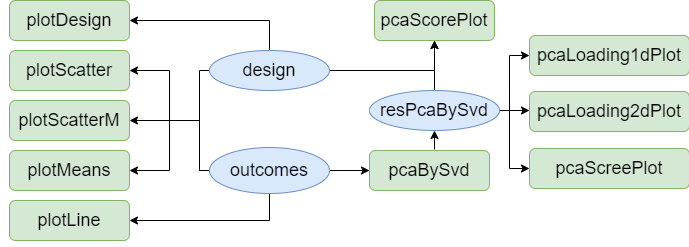
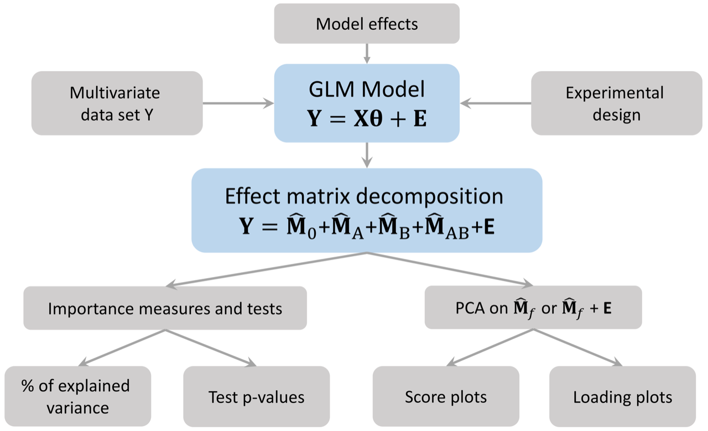
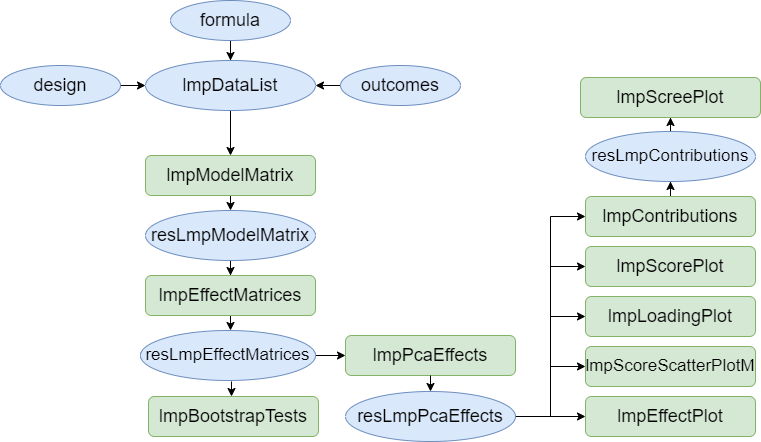

```{r Setup,include=FALSE}
# require(knitr)
knitr::opts_chunk$set(
    message = FALSE, warning = TRUE, comment = NA,
    crop = NULL,
    tidy.opts = list(width.cutoff = 60),
    tidy = TRUE, dpi = 50, dev = "png",
    fig.width = 5, fig.height = 3.5
)
rm(list = ls())

if (!requireNamespace("pander", quietly = TRUE)) {
    stop("Install 'pander' to knit this vignette")
}
library(pander)

library(ggplot2)
if (!requireNamespace("gridExtra", quietly = TRUE)) {
    stop("Install 'gridExtra' to knit this vignette")
}
library(gridExtra)

if (!requireNamespace("SummarizedExperiment", quietly = TRUE)) {
    stop("Install 'SummarizedExperiment' to knit this vignette")
}
library(SummarizedExperiment)
```


# Introduction

The purpose of this vignette is to show the possibilities offered by the `limpca` package. 

`limpca` stands for linear modeling of high-dimensional designed data based on ASCA/APCA family of methods. This package was created to analyse models with high-dimensional data and a multi-factor design of experiment and provides an implementation of ASCA and APCA derived methods.  

The model used in this example is a three-way ANOVA with fixed effects. This document presents all the usual steps of the analysis, from importing the data to visualising the results. Details on the methods used and the package implementation can be found in the articles of @Thiel2017, @Guisset2019 and @Thiel2023.

The motivation of publishing `limpca` in `bioconductor` is twofold. 
First, no `bioconductor` package includes ASCA/APCA methods and other `R` packages implementing them are very basic as explained in the literature review of @Thiel2023. 
Secondly, ASCA/APCA are highly informative methods to analyse -omics data tables in a multivariate framework as a complement to differential analyses packages like `limma`. 

# Installation and loading of the package

The package can be installed from Bioconductor:

```{r Install, eval=FALSE}
if (!requireNamespace("BiocManager", quietly = TRUE))
    install.packages("BiocManager")

BiocManager::install("limpca")
```

And then loaded in your R session: 

```{r Load, results=FALSE, message=FALSE}
library("limpca")
```


# Data importation

In order to use the limpca core functions, the data need to be formatted as a list (informally called an lmpDataList) with the following elements: `outcomes` (multivariate matrix), `design` (data.frame) and `formula` (character string). 
The `UCH` data set is already formatted appropriately and can be loaded from `limpca` with the `data` function.

```{r Data_Importation}
data("UCH")

str(UCH)
```


Alternatively, the lmpDataList can be created with the function `data2LmpDataList` :

- from scratch:

```{r, message = TRUE}
UCH2 <- data2LmpDataList(
   outcomes = UCH$outcomes,
   design = UCH$design, 
   formula = UCH$formula
 )
```

- or from a `SummarizedExperiment`:

```{r, message = TRUE}
se <- SummarizedExperiment(
   assays = list(
     counts = t(UCH$outcomes)), colData = UCH$design,
   metadata = list(formula = UCH$formula)
 )

UCH3 <- data2LmpDataList(se, assay_name = "counts")
```

`SummarizedExperiment` is a generic data container that stores rectangular matrices of experimental results. See @SummarizedExperiment23 for more information.


# Data exploration

The UCH (Urine-Citrate-Hippurate) data set is described in @Thiel2017 and @Guisset2019 and is issued form a metabolomics experiment.  In this experiment, 36 samples of a pool of rat urine samples were spiked with two molecules Citrate and Hippurate according to a $3^2$ full factorial design in the quantities of these two molecules.  The spiked samples were analyzed by ^1^H NMR at two different time after defrozing and over two different days.  Two of the spectra where finally missing at the end of the experiment.    

The UCH data set is a list containing 2 elements: 

* an `outcomes` matrix with 34 observations of 600 response variables representing the spectra from the ^1^H NMR spectroscopy, 
* a `design` matrix with 34 observations and 4 explanatory variables 

A `formula` with the general linear model to be estimated will be added to this list below. 

For the purpose of this example, only 3 factors of interest will be studied : concentrations of Hippurate and Citrate and Time after defrozing.

Here are the `limpca` functions that are available for data exploration.  





## Design

The design matrix contains the information about each observation for the four variables: Hippurate, Citrate, Day and Time. Only 3 of these variables are used in the model. The function `plotDesign` is useful to visualise the design.

```{r Design_visualization}
pander(head(UCH$design))
plotDesign(
    design = UCH$design, x = "Hippurate",
    y = "Citrate", rows = "Time",
    title = "Design of the UCH dataset"
)
```

This plot confirms that the design is a full 3x3x2 factorial design replicated twice with 2 missing values.  Hence, the design is not balanced. 

## Outcomes visualization

The 600 response (`outcomes`) variables represent, for each observation, the intensities of the ^1^H NMR spectra.   These spectra can be visualized by the `plotLine` function.

### `plotLine` function

Here, annotations (`cit_peaks` and `hip_peaks`) are added to the `ggplot` objects in order to highlight the Hippurate (green) and Citrate (red) peaks. 

```{r Spectrum_visualization}
p1 <- plotLine(
    Y = UCH$outcomes,
    title = "H-NMR spectrum",
    rows = c(3),
    xlab = "ppm",
    ylab = "Intensity"
)

cit_peaks <- annotate("rect",
    xmin = c(2.509), xmax = c(2.709),
    ymin = -Inf, ymax = Inf, alpha = 0.2,
    fill = c("tomato")
)

hip_peaks <- annotate("rect",
    xmin = c(7.458, 3.881), xmax = c(7.935, 4.041),
    ymin = -Inf, ymax = Inf, alpha = 0.2,
    fill = c("yellowgreen")
)

p1 <- plotLine(
    Y = UCH$outcomes,
    title = "H-NMR spectrum",
    rows = c(3),
    xlab = "ppm",
    ylab = "Intensity"
)

p1 + cit_peaks + hip_peaks
```

### `plotScatter` function

The `plotScatter` function enables to visualize the values of two outcomes variables with different colors or markers for the values of the design factors.  Here, it is used to show that the $3^2$ factorial design can be recovered from the intensities of the Hippurate and Citrate peaks in the spectra.  

```{r}
# xy corresponds to citrate (453) and hippurate peaks (369)
plotScatter(
    Y = UCH$outcomes,
    xy = c(453, 369),
    design = UCH$design,
    color = "Hippurate",
    shape = "Citrate"
)
# Or refering to the variables names (ppm values here)
plotScatter(
    Y = UCH$outcomes,
    xy = c("2.6092056", "3.9811536"),
    design = UCH$design,
    color = "Hippurate",
    shape = "Citrate"
)
```

### `plotScatterM` function

The `plotScatter` function allows to visualize the values of a series of outcomes variables with different colors or markers for the values of the design factors. Here, it is done for the 4 peaks of Hippurate and single peak of Citrate.

```{r, fig.width=6,fig.height=7}
plotScatterM(
    Y = UCH$outcomes, cols = c(133, 145, 150, 369, 453),
    design = UCH$design, varname.colorup = "Hippurate",
    varname.colordown = "Citrate"
)
```

### `plotMeans` function

The `plotMeans` represents the mean values of a response variable for different levels of the design factors. Here we show the evolution of the Citrate peak height with respect to the three design factors of interest. 
Note that the results of this function must be interpreted with caution for unbalanced designs because simple means are biased estimators of expected means. 

```{r}
plotMeans(
    Y = UCH$outcomes,
    design = UCH$design,
    cols = c(453),
    x = c("Citrate"),
    w = c("Hippurate"),
    z = c("Time"),
    ylab = "Intensity",
    title = c("Mean reponse for main Citrate peak")
)
```

## PCA {#pca}

The function `pcaBySvd` is useful to compute a Principal Component Analysis (PCA) decomposition of the `outcomes` matrix. Several functions can be applied to the output value of `pcaBySvd`:

* `pcaScreePlot` to obtaine a scree plot
* `pcaLoading1dPlot` for the loading plots
* `pcaScorePlot` for the score plots

```{r PCA}
ResPCA <- pcaBySvd(UCH$outcomes)
pcaScreePlot(ResPCA, nPC = 6)
```

The score plots below indicate that all tree factors from the design affect the spectral profiles, which will be more clearly highlighted by ASCA and APCA.  

```{r Scores}
pcaScorePlot(
    resPcaBySvd = ResPCA, axes = c(1, 2),
    title = "PCA scores plot: PC1 and PC2",
    design = UCH$design,
    color = "Hippurate", shape = "Citrate",
    points_labs_rn = FALSE
)

pcaScorePlot(
    resPcaBySvd = ResPCA, axes = c(1, 2),
    title = "PCA scores plot: PC1 and PC2",
    design = UCH$design,
    color = "Time", shape = "Hippurate",
    points_labs_rn = FALSE
)

pcaScorePlot(
    resPcaBySvd = ResPCA, axes = c(3, 4),
    title = "PCA scores plot: PC3 and PC4",
    design = UCH$design,
    color = "Time", shape = "Citrate",
    points_labs_rn = FALSE
)
```

In the first two loading plots, a mixture of Citrate and Hippurate peaks already appears but they are not separated.  

```{r Loadings}
p2 <- pcaLoading1dPlot(
    resPcaBySvd = ResPCA, axes = c(1, 2),
    title = "PCA loadings plot UCH", xlab = "ppm",
    ylab = "Intensity"
)

p2 + hip_peaks + cit_peaks
```

# Application of ASCA+ and APCA+ 

Here below, ASCA+ and APCA+ steps are illustrated on the `UCH` data set.  The following graph represents the steps of the methodology.   

The next graph presents the functions available in `limpca` for this purpose.  They are all illustrated in the next sections.  



# Model estimation and effect matrix decomposition

## Model formula

The formula of the ANOVA-GLM model used in this analysis is the 3 ways crossed ANOVA model:

```{r Formula}
UCH$formula <- "outcomes ~ Hippurate + Citrate + Time + Hippurate:Citrate +
                  Time:Hippurate + Time:Citrate + Hippurate:Citrate:Time"
```

## Model matrix generation

The first step of ASCA+ is to build the (GLM) model matrix from the experimental design matrix and the model. Each factor is reencoded with multiple binary variables using `contr.sum` coding. The size of the model matrix is  34xp  with p being the total number of parameters in the ANOVA model for one response.

The function `lmpModelMatrix` encodes the design matrix as a model matrix.

```{r ModelMatrix}
resLmpModelMatrix <- lmpModelMatrix(UCH)
pander::pander(head(resLmpModelMatrix$modelMatrix))
```

## Model estimation and effect matrices decomposition

`lmpEffectMatrices` is the used to estimate the linear model and decomposes the multivariate outcomes into effect matrices for every model term. This function calculates also type III effect contributions (in %) and generates a `barpot` to visualise these contributions.  

```{r EffectMatrices}
resLmpEffectMatrices <- lmpEffectMatrices(resLmpModelMatrix)
```

## Effects importance

The contributions from each effect is outputted from `lmpEffectMatrices`.

```{r}
pander(resLmpEffectMatrices$variationPercentages)
resLmpEffectMatrices$varPercentagesPlot
```

## Bootstrap tests and quantification of effects importance

`lmpBootstrapTests` applies a parametric bootstrap test to determine whether an effect is significant or not. We recommend the user to choose first a small value of `nboot` (e.g. nboot=100) to develop its code and increase it later on (e.g. nboot=1000) in order to get an accurate value for the p-values.    

```{r Bootstrap}
resLmpBootstrapTests <-
    lmpBootstrapTests(
        resLmpEffectMatrices = resLmpEffectMatrices,
        nboot = 100
    )

# Print P-values
pander::pander(t(resLmpBootstrapTests$resultsTable))
```


# ASCA/APCA/ASCA-E decomposition

The ASCA/APCA/ASCA-E decomposition enables to represent the information from the effect matrices in a space of reduced dimension through PCA. The function `lmpPcaEffects` has a method argument to define which method to use, namely `ASCA`, `APCA` or `ASCA-E`.  Combined effects matrices can also be built and visualized by PCA.  

## ASCA

The ASCA method performs PCA on the pure effect matrices.  Here a combined effect matrix `Hippurate+Time+Hippurate:Time` is also built.  

```{r ASCA_PCA}
resASCA <- lmpPcaEffects(
    resLmpEffectMatrices = resLmpEffectMatrices,
    method = "ASCA",
    combineEffects = list(c(
        "Hippurate", "Time",
        "Hippurate:Time"
    ))
)
```

### Contributions

The contribution of each principal component of the effects is calculated and reported in different tables and plots with the function `lmpContributions`. 

```{r ASCA_Contrib}
resLmpContributions <- lmpContributions(resASCA)
```

The tables are:

- `totalContribTable`: Table of the **contribution of each effect to the total variance in percentage** as outputted from `lmpEffectMatrices`.
```{r}
pander::pander(resLmpContributions$totalContribTable)
```

- `effectTable`: Table of the **percentage of variance explained by each Principal Component in each model effect decomposition**.

```{r}
pander::pander(resLmpContributions$effectTable)
```

- `combinedEffectTable`: Equivalent of the previous `effectTable` but for the *combination of effects* mentioned in `lmpPcaEffects`, here for `Hippurate+Time+Hippurate:Time`.
```{r}
pander::pander(resLmpContributions$combinedEffectTable)
```

- `contribTable`: Table of the **percentage of variance explained by each Principal Component of each effect reported to the percentage contribution of the given effect to the total variance**. This table gives an overview of the importance of each PC regardless of the effects.


```{r}
pander::pander(resLmpContributions$contribTable)
```

- Moreover `lmpContributions` also produces a barplot either with the ordered contributions per effect (`plotTotal`) or across all the PCs of the different effects (`plotContrib`).


```{r}
pander("Ordered contributions per effect:")
resLmpContributions$plotTotal

pander("For each PC of the different effects:")
resLmpContributions$plotContrib
```

In the following analysis, we will focus only on the first PC of the three main effects, the interaction `Hippurate:Time` and the residuals since the other PCs and effects account for less than 1% of the total variance.


### Scores and loadings Plots

The loadings can be represented either on a line plot with the function `lmpLoading1dPlot` to conveniently compare them with the original spectral profiles or on a scatterplot with the function `lmpLoading2dPlot`. 

Here we create an object including the loading plots (as line plots) for all the effects included in the model as well as the combined effect and the residuals.

```{r, include=TRUE}
all_loadings_pl <- lmpLoading1dPlot(resASCA,
    effectNames = c(
        "Hippurate", "Citrate", "Time",
        "Hippurate:Time",
        "Hippurate+Time+Hippurate:Time",
        "Residuals"
    ),
    axes = 1, xlab = "ppm"
)
```

The score matrices are represented two components at a time on a scatterplot with the function `lmpScorePlot`.   

#### Main effects

The scores and loadings of the main effects included in the model are represented below.

They show that, thank to the ASCA analysis, Hippurate and Citrate peaks are clearly and separately retrieved in the respective loading plots compared to the classical PCA (see Section \@ref(pca)) where peaks of these two chemicals are both present in the two first PCs. The loading profile of the `Time` effect shows a high peak on the left side of the removed water area.

```{r ASCA_ScoresXY}
# Hippurate
hip_scores_pl <- lmpScorePlot(resASCA,
    effectNames = "Hippurate",
    color = "Hippurate", shape = "Hippurate"
)

hip_loadings_pl <- all_loadings_pl$Hippurate + hip_peaks

grid.arrange(hip_scores_pl, hip_loadings_pl, ncol = 2)

# Citrate
cit_scores_pl <- lmpScorePlot(resASCA,
    effectNames = "Citrate",
    color = "Citrate", shape = "Citrate"
)
cit_loadings_pl <- all_loadings_pl$Citrate + cit_peaks

grid.arrange(cit_scores_pl, cit_loadings_pl, ncol = 2)

# Time
tim_scores_pl <- lmpScorePlot(resASCA,
    effectNames = "Time", color = "Time",
    shape = "Time"
)

time_peaks <- annotate("rect",
    xmin = c(5.955364), xmax = c(6.155364),
    ymin = -Inf, ymax = Inf, alpha = 0.2,
    fill = c("royalblue")
)

tim_loadings_pl <- all_loadings_pl$Time + time_peaks

grid.arrange(tim_scores_pl, tim_loadings_pl, ncol = 2)
```


#### Interaction `Hippurate:Time`

The scores and loadings fot the interaction term is represented here. It is not straighforward to interpret the scores plot of such an interaction term but the loadings of PC1 indicate a shift in the spectrum, along the whole spectral profile (but mostly around 3 ppm). 

```{r}
# Hippurate:Time
hiptim_scores_pl <- lmpScorePlot(resASCA,
    effectNames = "Hippurate:Time",
    color = "Hippurate", shape = "Time"
)
hiptim_loadings_pl <- all_loadings_pl$`Hippurate:Time` +
    time_peaks +
    hip_peaks

grid.arrange(hiptim_scores_pl, hiptim_loadings_pl, ncol = 2)
```

#### Combination of effects `Hippurate+Time+Hippurate:Time`

The scores and the loadings of a combination of effects, in this case `"Hippurate+Time+Hippurate:Time"` can also be visualised.

```{r}
# Hippurate+Time+Hippurate:Time
hiptimInter_scores_pl <- lmpScorePlot(resASCA,
    effectNames = "Hippurate+Time+Hippurate:Time",
    color = "Hippurate", shape = "Time"
)

hiptimInter_loadings_pl <- all_loadings_pl$`Hippurate:Time` +
    time_peaks + hip_peaks

grid.arrange(hiptimInter_scores_pl, hiptimInter_loadings_pl, ncol = 2)
```

However, note that a better graphical representation is possible with the function `lmpEffectPlot` (see Section \@ref(effects-plot)) to depict interaction terms or combinations of effects.


#### Model residuals

PCA on the model residuals can also be applied to spot outliers or an unexpected underlying structure of the data. The scores plot shows that the effect of `Day`, which was excluded in our modeling step, could have been included as well as it spans the two first PCs of the residuals. 

```{r Plot_Residuals}
resid_scores_pl <- lmpScorePlot(resASCA,
    effectNames = "Residuals",
    color = "Day", shape = "Day",
    drawShapes = "segment"
)


resid_loadings_pl <- all_loadings_pl$Residuals

grid.arrange(resid_scores_pl, resid_loadings_pl, ncol = 2)
```


### Other graphs

#### Scores scatter plot

We can also represent the scores as a matrix of plots with `lmpScoreScatterPlotM`. This graph has the advantage to compare more than 2 variables simultaneously. For example, the PC1 scores of `Hippurate`  and `Citrate` clearly represent the orthogonal design of this experiment. The interaction `Hippurate:Time` can also be clearly represented when comparing les PC1s of `Hippurate` and the interaction term.

```{r ASCA_ScoresMatrix, fig.height=7}
lmpScoreScatterPlotM(resASCA,
    PCdim = c(1, 1, 1, 1, 1, 1, 1, 2),
    modelAbbrev = TRUE,
    varname.colorup = "Citrate",
    varname.colordown = "Time",
    varname.pchup = "Hippurate",
    varname.pchdown = "Time",
    title = "ASCA scores scatterplot matrix"
)
```

#### 2D Loadings

Finally the loadings can also be represented 2-by-2 as a scatterplot with `lmpLoading2dPlot`.  Such graphic is of course of limited interest for spectral data.  

```{r ASCA_loadings}
lmpLoading2dPlot(
    resLmpPcaEffects = resASCA,
    effectNames = c("Hippurate"),
    axes = c(1, 2),
    addRownames = TRUE, pl_n = 10
)

# adding manually labels to points for the Hippurate peaks
labels <- substr(colnames(UCH$outcomes), 1, 4)
labels[-c(369, 132, 150, 133, 149, 144, 145, 368, 151)] <- ""

lmpLoading2dPlot(
    resLmpPcaEffects = resASCA,
    effectNames = c("Hippurate"),
    axes = c(1, 2), points_labs = labels
)
```


### Effects plot {#effects-plot}

The `lmpEffectPlot` function is particularly interesting to visualise an interaction term or a combination of effects. Note that this function can only be applied with the `ASCA` method.


#### Main effects for `Hippurate`

Here the first PC of the `Hippurate` is represented along the levels of this effect showing an expected linear effect of Hippurate dose on the PC value.

```{r}
lmpEffectPlot(resASCA, effectName = "Hippurate", x = "Hippurate")
```


#### Interaction `Hippurate:Time`

A more interesting application is the visualization of interaction terms as line plots, here `Hippurate:Time` along the `Hippurate` or the `Time` effect. This representation gives the impression of a quite important interaction effect.

```{r}
lmpEffectPlot(resASCA,
    effectName = "Hippurate:Time",
    x = "Hippurate", z = "Time"
)
lmpEffectPlot(resASCA,
    effectName = "Hippurate:Time",
    x = "Time", z = "Hippurate"
)
```


#### Combination of effects `Hippurate+Time+Hippurate:Time`

An alternative visualisation of this interaction combines the main effects of `Hippurate`, `Time` and the interaction `Hippurate:Time`. Even if significant, the interaction effect is actually quite small compared to the main effects (`Hippurate` for PC1 and `Time` for PC2).

```{r ASCA_effects}
lmpEffectPlot(resASCA,
    effectName = "Hippurate+Time+Hippurate:Time",
    x = "Hippurate", z = "Time"
)
lmpEffectPlot(resASCA,
    effectName = "Hippurate+Time+Hippurate:Time",
    axes = c(2), x = "Time", z = "Hippurate"
)
```


## APCA

The APCA method performs PCA on the effect matrices augmented by the residuals. The same functions already used for ASCA can be applied.

```{r APCA_PCA}
resAPCA <- lmpPcaEffects(
    resLmpEffectMatrices = resLmpEffectMatrices,
    method = "APCA"
)
```

### Scores Plot

Different shapes with the `drawShapes` argument highlight the data structure recovery.

```{r APCA_ScoresXY}
# Hippurate main effect
lmpScorePlot(resAPCA,
    effectNames = "Hippurate",
    color = "Hippurate", shape = "Hippurate", drawShapes = "ellipse"
)

# Citrate main effect
lmpScorePlot(resAPCA,
    effectNames = "Citrate",
    color = "Citrate", shape = "Citrate", drawShapes = "ellipse"
)

# Time main effect
lmpScorePlot(resAPCA,
    effectNames = "Time",
    color = "Time", shape = "Time", drawShapes = "ellipse"
)
lmpScorePlot(resAPCA,
    effectNames = "Time",
    color = "Time", shape = "Time", drawShapes = "polygon"
)
lmpScorePlot(resAPCA,
    effectNames = "Time",
    color = "Time", shape = "Time", drawShapes = "segment"
)

# Interaction term
lmpScorePlot(resAPCA,
    effectNames = "Hippurate:Time",
    color = "Hippurate", shape = "Time", drawShapes = "segment"
)
lmpScorePlot(resAPCA,
    effectNames = "Hippurate:Time",
    color = "Hippurate", shape = "Time", drawShapes = "polygon"
)
```

A scatterplot matrix can also be applied to visualise the relationship between the scores profiles of interest.

```{r APCA_ScoresMatrix}
lmpScoreScatterPlotM(resAPCA,
    effectNames = c(
        "Hippurate", "Citrate", "Time",
        "Hippurate:Time"
    ),
    modelAbbrev = TRUE,
    varname.colorup = "Citrate",
    varname.colordown = "Time",
    varname.pchup = "Hippurate",
    varname.pchdown = "Time",
    title = "APCA scores scatterplot matrix"
)
```

### Loadings plot


Note that the APCA loadings contain the residuals of the model and differ from the ASCA loadings in that respect.

```{r APCA_loadings}
lmpLoading1dPlot(resAPCA, effectNames = c(
    "Hippurate", "Citrate",
    "Time", "Hippurate:Time"
), axes = 1)
```

## ASCA-E

The ASCA-E method performs PCA on the pure effect matrices then projects the effect matrices augmented with residuals on the PC obtained.  

```{r ASCAE_PCA}
resASCAE <- lmpPcaEffects(
    resLmpEffectMatrices = resLmpEffectMatrices,
    method = "ASCA-E"
)
```

The contributions and loadings are identical to the ASCA results.

### Scores Plot

For the main effects, all score plots show a clear separation between the different levels of the considered effects on the first PC. This separation of the groups suggests a strong effect of those factors, confirmed by their significance.

```{r ASCAE_ScoresXY}
lmpScorePlot(resASCAE,
    effectNames = "Hippurate",
    color = "Hippurate", shape = "Hippurate"
)
lmpScorePlot(resASCAE,
    effectNames = "Citrate",
    color = "Citrate", shape = "Citrate"
)
lmpScorePlot(resASCAE,
    effectNames = "Time",
    color = "Time", shape = "Time"
)
lmpScorePlot(resASCAE,
    effectNames = "Hippurate:Time",
    color = "Hippurate", shape = "Time"
)
```

Again, the scores profiles can be compared 2 by 2 with ASCA-E.
```{r ASCAE_ScoresMatrix}
lmpScoreScatterPlotM(resASCAE,
    effectNames = c(
        "Hippurate", "Citrate", "Time",
        "Hippurate:Time"
    ),
    modelAbbrev = TRUE,
    varname.colorup = "Citrate",
    varname.colordown = "Time",
    varname.pchup = "Hippurate",
    varname.pchdown = "Time",
    title = "ASCA-E scores scatterplot matrix"
)
```


# sessionInfo
```{r}
sessionInfo()
```

# References
